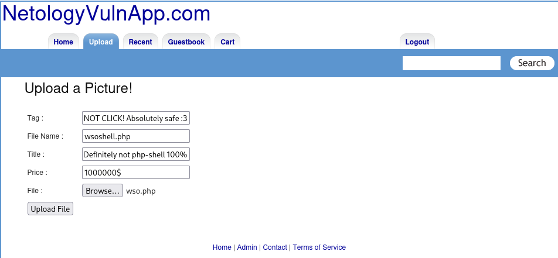
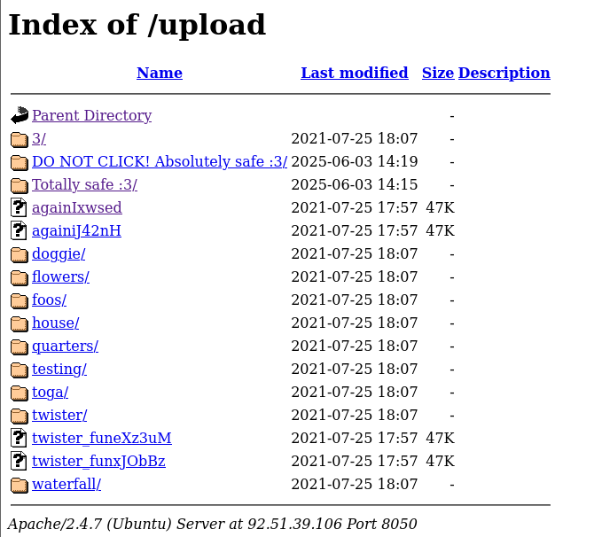
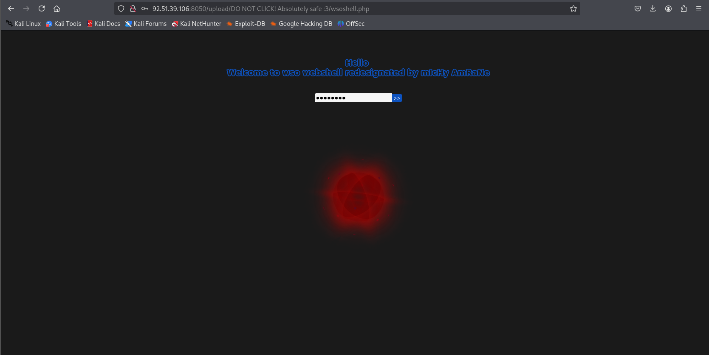
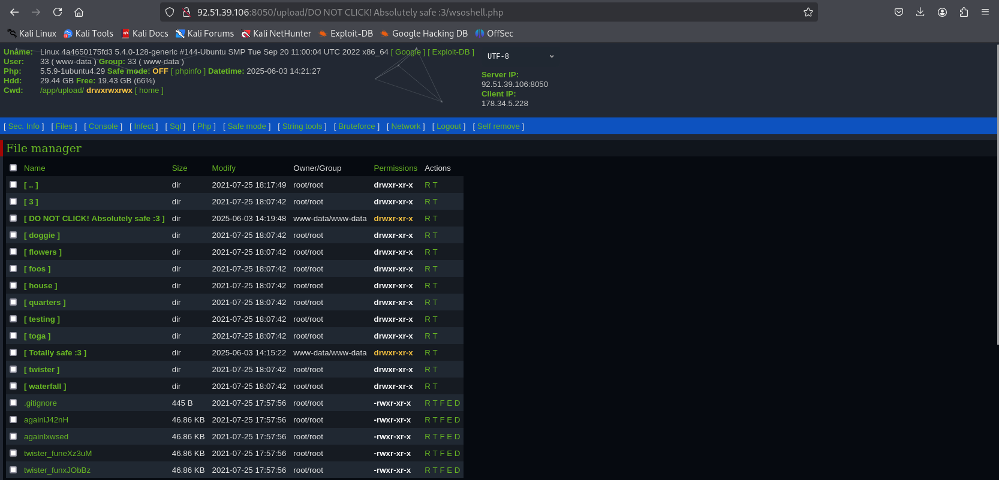
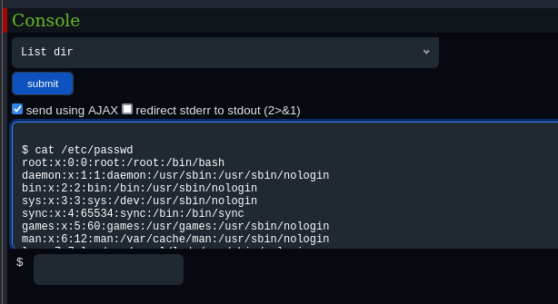
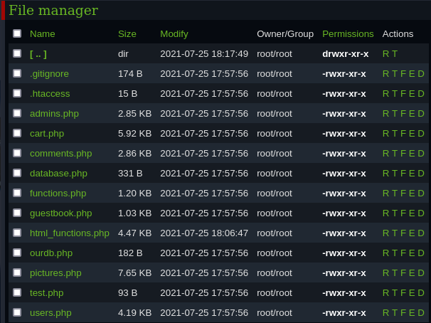
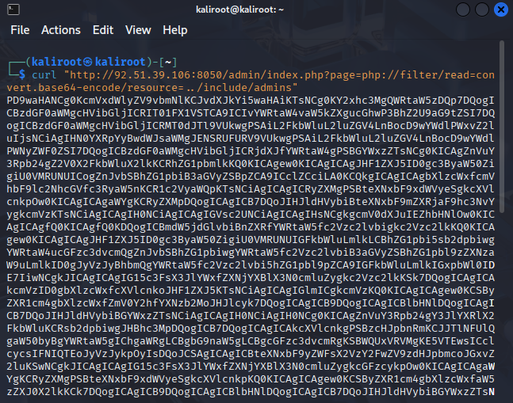
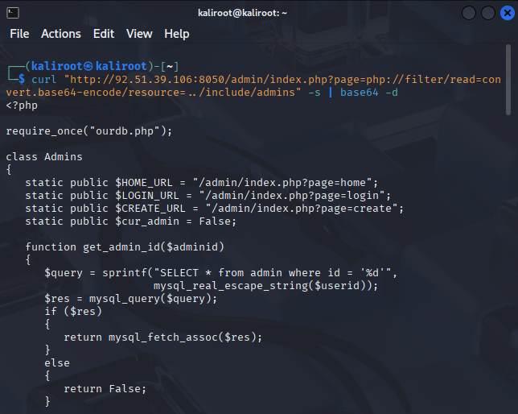
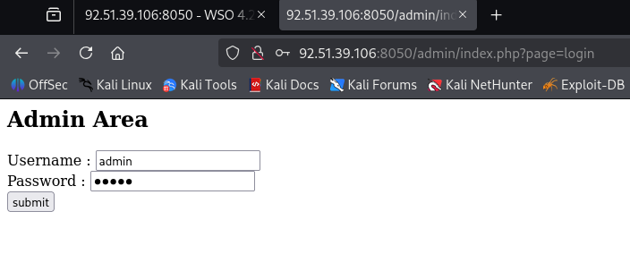
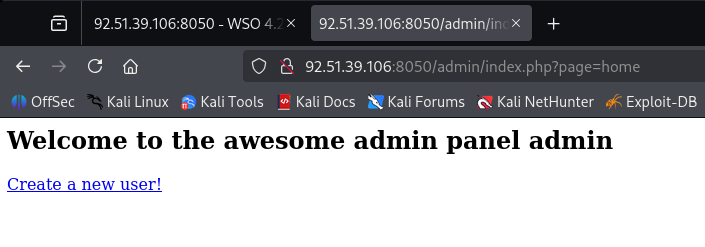

# Этап №3. Testing

## Вводная информация

На предыдущем этапе было проведено сканирование двух целевых веб-приложений — `NetologyVulnApp.com (8050)` и `Beemer (7788)`, в результате которого были выявлены основные уязвимости, ставшие основой для дальнейшего ручного Penetration testing.

Однако полученный перечень уязвимостей не является исчерпывающим, также дополнительно будут исследованы потенциальные уязвимости, которые могли быть пропущены автоматическими сканерами.

Основными источниками информации для тестирования послужили:
- [OWASP Web Security Testing Guide](https://owasp.org/www-project-web-security-testing-guide/)
- [OWASP Top 10](https://owasp.org/www-project-top-ten/)
- [OWASP Cheat Sheets](https://cheatsheetseries.owasp.org/)
- [Книга Андрея Бирюкова «Информационная безопасность. Защита и нападение»](https://dmkpress.com/catalog/computer/securuty/978-5-93700-219-8/?srsltid=AfmBOopHiNlFCvwZMa-awRfJnO7HYnrBu95LsXbc_cnN_9TyI6LgVBV3)

### Таблица с обнаруженными уязвимостями по OWASP Top 10
| №  | Уровень риска | Уязвимость                                  | OWASP                                          | Уязвимая ИС (port) |
|----|---------------|---------------------------------------------|------------------------------------------------|--------------------|
| 1  | Критический   | SQL Injection                               | [A03:2021-Injection](https://owasp.org/Top10/A03_2021-Injection/)                        | 8050, 7788         |
| 2  | Критический   | Command Injection                           | [A03:2021-Injection](https://owasp.org/Top10/A03_2021-Injection/)                          | 7788               |
| 3  | Критический   | Unrestricted File Upload                    | [A05:2021-Security Misconfiguration](https://owasp.org/Top10/A05_2021-Security_Misconfiguration/)          | 8050, 7788         |
| 4  | Высокий       | Path Traversal                              | [A01:2021-Broken Access Control](https://owasp.org/Top10/A01_2021-Broken_Access_Control/)              | 8050, 7788         |
| 5  | Высокий       | Exposed credentials in public GitHub repository | [A07:2021-Identification and Authentication Failures](https://owasp.org/Top10/A07_2021-Identification_and_Authentication_Failures/) | 7788               |
| 6  | Высокий       | Insecure Transmission of Sensitive Data     | [A02:2021-Cryptographic Failures](https://owasp.org/Top10/A02_2021-Cryptographic_Failures/)             | 8050, 7788         |
| 7  | Высокий       | Session Hijacking Attack                    | [A07:2021-Identification and Authentication Failures](https://owasp.org/Top10/A07_2021-Identification_and_Authentication_Failures/) | 8050               |
| 8  | Средний       | Weak Admin Password                         | [A07:2021-Identification and Authentication Failures](https://owasp.org/Top10/A07_2021-Identification_and_Authentication_Failures/) | 8050               |
| 9  | Средний       | Brute Force Attack                          | [A07:2021-Identification and Authentication Failures](https://owasp.org/Top10/A07_2021-Identification_and_Authentication_Failures/) | 8050, 7788         |
| 10 | Средний       | Cross-Site Scripting (XSS)                  | [A03:2021-Injection](https://owasp.org/Top10/A03_2021-Injection/)                          | 8050, 7788         |

---

## Тестирование NetologyVulnApp.com (8050)

### 1. Vulnerability - Unrestricted File Upload

**OWASP:** [A05:2021-Security Misconfiguration](https://owasp.org/Top10/A05_2021-Security_Misconfiguration/)

**Уровень риска:** Критический

**Целевая страница:** `http://92.51.39.106:8050/upload/`

**Краткое описание:**

Уязвимость **Unrestricted File Upload** позволяет загружать на веб-ресурс произвольные файлы, включая вредоносные, такие как шеллы, скрипты и другие типы файлов, которые изначально не предназначены для обработки. В рамках исследования этой уязвимости будет использован PHP-shell.

**Реализация:**

<details>
<summary>Пошаговая реализация</summary>

- **Step 1. Загрузка файла**
    
Переходим на страницу загрузки файла и заполняем все обязательные поля формы. Название и описание файла не имеют значения. В окне выбора файла выбираем заранее подготовленный PHP-шелл.

В моем случае это open-source PHP shell - [wso-webshell](https://github.com/mIcHyAmRaNe/wso-webshell)



- **Step 2. Возможность доступа**

Ранее на этапе сканирования веб-приложений, инструментом `FFUF`, была обнаружена уязвимая директория `/upload`, в которой и располагается наш ранее установленный shell.


    
- **Step 3. Запуск PHP-shell**

Открываем файл `wsoshell.php`


    
- **Step 4. Авторизация**

Вводим стандартный пароль `ghost287` и попадаем в графический интерфейс shell, в котором в дальнейшем и будем выполнять наши действия.
    

    
- **Step 5. Доступ к "чувствительным данным"**
    
Имея хоть и ограниченный, но довольно высокий уровень доступа, пробуем просмотреть файл `/etc/passwd`
    


- **Вывод**
    
Доступ к файлу получен, значит **уязвимость подтверждена**.

(wso-webshell имеет гораздо больший функционал для дальнейшей эскалации, но в рамках выполнения дипломной работы, дальнейшая эскалация и нарушение работы приложения будут излишними).
</details>

**Рекомендации по устранению:**

- **Ограничение типов файлов**: Разрешайте загрузку только файлов с заранее определёнными типами (например, `.jpg` `.png` `.gif`).
- **Ограничение размера файла**: Установите максимальный размер загружаемого файла, чтобы предотвратить загрузку больших вредоносных файлов.
- **Изоляция загруженных файлов**: Храните загруженные файлы вне веб-доступной директории.
- **Ограничение прав доступа**: Убедитесь, что загруженные файлы не имеют прав на выполнение.
___

### 2. Vulnerability - Path Traversal

**OWASP:** [A01:2021-Broken Access Control](https://owasp.org/Top10/A01_2021-Broken_Access_Control/)

**Уровень риска:** Высокий

**Целевая страница:** `http://92.51.39.106:8050/admin/index.php?page=home`

**Краткое описание:**

Существует возможность взаимодействия с файловой системой, включая доступ к файлам на хосте и исходному коду веб-страниц.

**Реализация:**

<details>
<summary>Пошаговая реализация</summary>

- **Step 1. Структура файловой системы**
    
Ранее реализовав уязвимость **Unrestricted File Upload**, удалось получить представление о структуре файловой системы на сервере.



- **Step 2. Получение исходного кода страницы**

Для примера возьмем страницу `/include/admins`, которую удалось обнаружить в директории сервера.
    
Сервер не дает прямого доступа к исходному коду, необходимо выгрузить его в формате **base64**.
    
Для выгрузки исходного кода воспользуемся инструментом `curl` + **base64-encode**.
    
```
curl "http://92.51.39.106:8050/admin/index.php?page=php://filter/read=convert.base64-encode/resource=../include/admins"
```


   
- **Step 3. Декодирование кода**

Далее при помощи все того же `curl`, декодируем исходную страницу.

```
curl "http://92.51.39.106:8050/admin/index.php?page=php://filter/read=convert.base64-encode/resource=../include/admins" -s | base64 -d
```



- **Вывод**
    
Исходный код страницы получен, **уязвимость подтверждена**.

Исходный код страницы `/include/admins` : [admins](other/code/admins_code.txt)

</details>

**Рекомендации по устранению:**

- **Валидация и санитизация входных данных**: Проверяйте и очищайте все входные параметры, используемые для доступа к ФС.
- **Ограничение доступа к файлам**: Убедитесь, что приложение обращается только к файлам в пределах безопасной директории.
- **Отключение прямого доступа к ФС**: Избегайте использования пользовательского ввода для прямого формирования путей к файлам.
- **Настройка прав доступа на сервере**: Ограничьте права доступа к файлам и директориям на уровне ОС.

___

### 3. Vulnerability - Weak Admin Password

**OWASP:** [A07:2021-Identification and Authentication Failures](https://owasp.org/Top10/A07_2021-Identification_and_Authentication_Failures/)

**Уровень риска:** Средний

**Целевая страница:** `http://92.51.39.106:8050/admin/index.php?page=login`

**Краткое описание:**

Существует риск несанкционированного доступа к административной части сайта из-за использования стандартной и предсказуемой комбинации логина и пароля.

логин/пароль : `admin/admin`

**Реализация:**
<details>
<summary>Пошаговая реализация</summary>


- **Step 1. Авторизация**
    
Переходим на страницу авторизации **Admin**:
`http://92.51.39.106:8050/admin/index.php?page=login`
    



- **Step 2. Получаем доступ**

Вводим стандартную комбинацию логин/пароль : `admin/admin`


   

- **Вывод**
    
Доступ к **Admin** части сайта получен, **уязвимость подтверждена**.

</details>

**Рекомендации по устранению:**
- **Усиление политики паролей**: Внедрите требования к созданию сложных паролей.
- **Изменение стандартных учётных данных**: Замените стандартную связку `admin/admin` на уникальную и сложную комбинацию.
___
