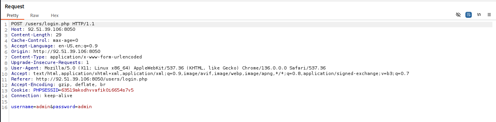

# Этап №3. Testing

## Вводная информация

На предыдущем этапе было проведено сканирование двух целевых веб-приложений — `NetologyVulnApp.com (8050)` и `Beemer (7788)`, в результате которого были выявлены основные уязвимости, ставшие основой для дальнейшего ручного Penetration testing.

Однако полученный перечень уязвимостей не является исчерпывающим, также дополнительно будут исследованы потенциальные уязвимости, которые могли быть пропущены автоматическими сканерами.

Основными источниками информации для тестирования послужили:
- [OWASP Web Security Testing Guide](https://owasp.org/www-project-web-security-testing-guide/)
- [OWASP Top 10](https://owasp.org/www-project-top-ten/)
- [OWASP Cheat Sheets](https://cheatsheetseries.owasp.org/)
- [Книга Андрея Бирюкова «Информационная безопасность. Защита и нападение»](https://dmkpress.com/catalog/computer/securuty/978-5-93700-219-8/?srsltid=AfmBOopHiNlFCvwZMa-awRfJnO7HYnrBu95LsXbc_cnN_9TyI6LgVBV3)

### Таблица с обнаруженными уязвимостями по OWASP Top 10
| №  | Уровень риска | Уязвимость                                  | OWASP                                          | Уязвимая ИС (port) |
|----|---------------|---------------------------------------------|------------------------------------------------|--------------------|
| 1  | Критический   | SQL Injection                               | [A03:2021-Injection](https://owasp.org/Top10/A03_2021-Injection/)                        | 8050, 7788         |
| 2  | Критический   | Command Injection                           | [A03:2021-Injection](https://owasp.org/Top10/A03_2021-Injection/)                          | 7788               |
| 3  | Критический   | Unrestricted File Upload                    | [A05:2021-Security Misconfiguration](https://owasp.org/Top10/A05_2021-Security_Misconfiguration/)          | 8050, 7788         |
| 4  | Высокий       | Path Traversal                              | [A01:2021-Broken Access Control](https://owasp.org/Top10/A01_2021-Broken_Access_Control/)              | 8050, 7788         |
| 5  | Высокий       | Exposed credentials in public GitHub repository | [A07:2021-Identification and Authentication Failures](https://owasp.org/Top10/A07_2021-Identification_and_Authentication_Failures/) | 7788               |
| 6  | Высокий       | Insecure Transmission of Sensitive Data     | [A02:2021-Cryptographic Failures](https://owasp.org/Top10/A02_2021-Cryptographic_Failures/)             | 8050, 7788         |
| 7  | Высокий       | Session Hijacking Attack                    | [A07:2021-Identification and Authentication Failures](https://owasp.org/Top10/A07_2021-Identification_and_Authentication_Failures/) | 8050               |
| 8  | Средний       | Weak Admin Password                         | [A07:2021-Identification and Authentication Failures](https://owasp.org/Top10/A07_2021-Identification_and_Authentication_Failures/) | 8050               |
| 9  | Средний       | Brute Force Attack                          | [A07:2021-Identification and Authentication Failures](https://owasp.org/Top10/A07_2021-Identification_and_Authentication_Failures/) | 8050, 7788         |
| 10 | Средний       | Cross-Site Scripting (XSS)                  | [A03:2021-Injection](https://owasp.org/Top10/A03_2021-Injection/)                          | 8050, 7788         |

---

## Тестирование NetologyVulnApp.com (8050)

### 1. Vulnerability - Unrestricted File Upload

**OWASP:** [A05:2021-Security Misconfiguration](https://owasp.org/Top10/A05_2021-Security_Misconfiguration/)

**Уровень риска:** Критический

**Целевая страница:** `http://92.51.39.106:8050/upload/`

**Краткое описание:**

Уязвимость **Unrestricted File Upload** позволяет загружать на веб-ресурс произвольные файлы, включая вредоносные, такие как шеллы, скрипты и другие типы файлов, которые изначально не предназначены для обработки. В рамках исследования этой уязвимости будет использован PHP-shell.

**Реализация:**

<details>
<summary>Пошаговая реализация</summary>

- **Step 1. Загрузка файла**
    
Переходим на страницу загрузки файла и заполняем все обязательные поля формы. Название и описание файла не имеют значения. В окне выбора файла выбираем заранее подготовленный PHP-шелл.

В моем случае это open-source PHP shell - [wso-webshell](https://github.com/mIcHyAmRaNe/wso-webshell)


- **Step 2. Возможность доступа**

Ранее на этапе сканирования веб-приложений, инструментом `FFUF`, была обнаружена уязвимая директория `/upload`, в которой и располагается наш ранее установленный shell.


    
- **Step 3. Запуск PHP-shell**

Открываем файл `wsoshell.php`


    
- **Step 4. Авторизация**

Вводим стандартный пароль `ghost287` и попадаем в графический интерфейс shell, в котором в дальнейшем и будем выполнять наши действия.
    

    
- **Step 5. Доступ к "чувствительным данным"**
    
Имея хоть и ограниченный, но довольно высокий уровень доступа, пробуем просмотреть файл `/etc/passwd`
    


- **Вывод**
    
Доступ к файлу получен, значит **уязвимость подтверждена**.

(wso-webshell имеет гораздо больший функционал для дальнейшей эскалации, но в рамках выполнения дипломной работы, дальнейшая эскалация и нарушение работы приложения будут излишними).
</details>

**Рекомендации по устранению:**

- **Ограничение типов файлов**: Разрешайте загрузку только файлов с заранее определёнными типами (например, `.jpg` `.png` `.gif`).
- **Ограничение размера файла**: Установите максимальный размер загружаемого файла, чтобы предотвратить загрузку больших вредоносных файлов.
- **Изоляция загруженных файлов**: Храните загруженные файлы вне веб-доступной директории.
- **Ограничение прав доступа**: Убедитесь, что загруженные файлы не имеют прав на выполнение.
___

### 2. Vulnerability - Path Traversal

**OWASP:** [A01:2021-Broken Access Control](https://owasp.org/Top10/A01_2021-Broken_Access_Control/)

**Уровень риска:** Высокий

**Целевая страница:** `http://92.51.39.106:8050/admin/index.php?page=home`

**Краткое описание:**

Из-за недостаточной фильтрации и валидации пользовательского ввода, существует возможность взаимодействия с файловой системой, включая доступ к файлам на хосте и исходному коду веб-страниц.

**Реализация:**

<details>
<summary>Пошаговая реализация</summary>

- **Step 1. Структура файловой системы**
    
Ранее реализовав уязвимость **Unrestricted File Upload**, удалось получить представление о структуре файловой системы на сервере.


- **Step 2. Получение исходного кода страницы**

Для примера возьмем страницу `/include/admins`, которую удалось обнаружить в директории сервера.
    
Сервер не дает прямого доступа к исходному коду, необходимо выгрузить его в формате **base64**.
    
Для выгрузки исходного кода воспользуемся инструментом `curl` + **base64-encode**.
    
```
curl "http://92.51.39.106:8050/admin/index.php?page=php://filter/read=convert.base64-encode/resource=../include/admins"
```


   
- **Step 3. Декодирование кода**

Далее при помощи все того же `curl`, декодируем исходную страницу.

```
curl "http://92.51.39.106:8050/admin/index.php?page=php://filter/read=convert.base64-encode/resource=../include/admins" -s | base64 -d
```


- **Вывод**
    
Исходный код страницы получен, **уязвимость подтверждена**.

Исходный код страницы `/include/admins` : [admins](other/code/admins_code.txt)

</details>

**Рекомендации по устранению:**

- **Валидация и санитизация входных данных**: Проверяйте и очищайте все входные параметры, используемые для доступа к ФС.
- **Ограничение доступа к файлам**: Убедитесь, что приложение обращается только к файлам в пределах безопасной директории.
- **Отключение прямого доступа к ФС**: Избегайте использования пользовательского ввода для прямого формирования путей к файлам.
- **Настройка прав доступа на сервере**: Ограничьте права доступа к файлам и директориям на уровне ОС.

___

### 3. Vulnerability - Weak Admin Password

**OWASP:** [A07:2021-Identification and Authentication Failures](https://owasp.org/Top10/A07_2021-Identification_and_Authentication_Failures/)

**Уровень риска:** Средний

**Целевая страница:** `http://92.51.39.106:8050/admin/index.php?page=login`

**Краткое описание:**

Существует риск несанкционированного доступа к административной панели сайта из-за использования стандартной и предсказуемой комбинации логина и пароля.

логин/пароль : `admin/admin`

**Реализация:**
<details>
<summary>Пошаговая реализация</summary>

- **Step 1. Авторизация**
    
Переходим на страницу авторизации **Admin**:
`http://92.51.39.106:8050/admin/index.php?page=login`
    


- **Step 2. Получаем доступ**

Вводим стандартную комбинацию логин/пароль : `admin/admin`


   
- **Вывод**
    
Доступ к **Admin** панели сайта получен, **уязвимость подтверждена**.

</details>

**Рекомендации по устранению:**
- **Усиление политики паролей**: Внедрите требования к созданию сложных паролей.
- **Изменение стандартных учётных данных**: Замените стандартную связку `admin/admin` на уникальную и сложную комбинацию.
___

### 4. Vulnerability - Insecure Transmission of Sensitive Data

**OWASP:** [A02:2021 – Cryptographic Failures](https://owasp.org/Top10/A02_2021-Cryptographic_Failures/)

**Уровень риска:** Высокий

**Целевая страница:** `http://92.51.39.106:8050/users/login.php`

**Краткое описание:**

Данные пользователя передаются в незашифрованном виде, что делает их уязвимыми для различных атак, включая атаку типа "человек посередине" (MITM).

**Реализация:**

<details>
<summary>Пошаговая реализация</summary>

- **Step 1. Авторизация**
    
Переходим на страницу авторизации пользователя и отправляем запрос:
`http://92.51.39.106:8050/users/login.php`
    


- **Step 2. Перехват трафика**

С помощью программы `Burp Suite` осуществляем перехват аутентификационных данных пользователя:


   
- **Вывод**
    
В `Burp Suite` видим перехваченные аутентификационные данные пользователя `admin/admin`, передаваемые в незашифрованном виде, **уязвимость подтверждена**.

</details>

**Рекомендации по устранению:**

- **Шифрование соединения** : Настройте веб-сервер для использования протокола HTTPS.
- **Получение сертификата** : Используйте сертификаты от доверенных центров сертификации.
- **Принудительное использование HTTPS** : Настройте перенаправление всех HTTP-запросов на HTTPS с помощью заголовка Strict-Transport-Security (HSTS).
- **Шифрование конфиденциальных данных** : Используйте алгоритмы шифрования, такие как **AES-256**, для защиты данных перед их передачей.

___

### 5. Vulnerability - SQL Injection

**OWASP:** [A03:2021-Injection](https://owasp.org/Top10/A03_2021-Injection/)

**Уровень риска:** Критический 

**Целевая страница:** `http://92.51.39.106:8050/users/login.php`

**Краткое описание:**

Уязвимость SQLi, позволяет внедрить произвольные SQL-запросы, что может привести к несанкционированному доступу и компрометации учетной записи.

**Реализация:**
<details>
<summary>Пошаговая реализация</summary>

- **Step 1. Сканирование инструментом sqlmap**
    
Для проверки целевого веб-ресурса на наличие уязвимостей типа SQL-инъекций был использован инструмент `sqlmap`. Данный инструмент позволяет в автоматическом режиме выявлять уязвимости, связанные с некорректной обработкой SQL-запросов.
    


- **Step 2. Реализация SQLi**

В результате анализа было выявлено, что тестируемая веб-страница уязвима к атакам типа **SQLi**. Для подтверждения уязвимости на странице авторизации была введена следующая SQL-команда: `' OR TRUE #`.


- **Вывод**
    
После ввода указанной SQL-команды система авторизации предоставила доступ под учётной записью встроенного пользователя `Sample User`, **уязвимость подтверждена**.

</details>

**Рекомендации по устранению:**

- **Использование параметризованных запросов** : Применяйте параметризованные запросы для предотвращения внедрения пользовательского ввода в SQL-запросы.
- **Экранирование данных** : Используйте функции для корректного экранирования специальных символов в пользовательском вводе.
- **Валидация и фильтрация ввода** : Проверяйте и ограничивайте пользовательский ввод, допуская только ожидаемые форматы данных.

___

### 6. Vulnerability - Brute Force Attack 

**OWASP:** [A07:2021-Identification and Authentication Failures](https://owasp.org/Top10/A07_2021-Identification_and_Authentication_Failures/)

**Уровень риска:** Средний

**Целевая страница:** `http://92.51.39.106:8050/users/login.php`

**Краткое описание:**

Отсутствие ограничений на количество попыток ввода пароля при авторизации создаёт уязвимость, позволяющую реализовать атаку типа **brute-force**. Тем самым появляется возможность неограниченно подбирать комбинации логина и пароля с использованием общедоступных словарей.

**Реализация:**

<details>
<summary>Пошаговая реализация</summary>

- **Step 1. Подбор инструмента и словарей**
    
Для выполнения атаки типа "грубый перебор" (brute-force) был применён инструмент `Hydra`, специально разработанный для автоматизации подобных атак. В качестве входных данных использовались предварительно подготовленные списки возможных логинов и паролей, так называемые **"словари"**.
    
Для проведения атаки были использованы следующие общедоступные словари:
- [login dictionary](other/dictionaries/usernames.txt)
- [pass dictionary](other/dictionaries/passwords.txt)

- **Step 2. Brute-force attack**

Для реализации атаки была использована следующая конфигурация инструмента `Hydra`:
    
```
hydra -l admin -P passwords.txt -s 8050 -t 4 -v -f 92.51.39.106 http-post-form "/users/login.php:username=^USER^&password=^PASS^:F=The username/password combination you have entered is invalid"    
```


   
- **Вывод**
    
В результате проведённой атаки с использованием инструмента `Hydra` была успешно подобрана верная комбинация логина и пароля для учётной записи администратора: `admin/admin`, **уязвимость подтверждена**.

</details>

**Рекомендации по устранению:**

- **Ограничение количества попыток авторизации** : Внедрите механизм задержки после заданного числа неудачных попыток ввода пароля.
- **Использование CAPTCHA** : Добавьте CAPTCHA после нескольких неудачных попыток авторизации для предотвращения автоматизированных атак.
- **Усиление политики паролей** : Требуйте от пользователей создания более сложных паролей, чтобы снизить вероятность успешного подбора.

___

### 7. Vulnerability - Cross-Site Scripting (XSS)

**OWASP:** [A03:2021-Injection](https://owasp.org/Top10/A03_2021-Injection/)

**Уровень риска:** Средний

**Целевая страница:** `http://92.51.39.106:8050/pictures/view.php` , `http://92.51.39.106:8050/guestbook.php`

**Краткое описание:**

Уязвимость **XSS**, позволяет внедрить и выполнить вредоносный JavaScript-код в веб-приложении, что может привести к краже данных пользователя или выполнению несанкционированных действий.

**Реализация:**

<details>
<summary>Пошаговая реализация</summary>

- **Step 1. XSS на странице View.php**
    
Для реализации уязвимости на странице `http://92.51.39.106:8050/pictures/view.php`, была использована полезная нагрузка, которая выполняет JavaScript-код, вызывающий функцию Alert, в качестве содержимого окна выводится значение `document.cookie` пользователя:

```
<script>alert(document.cookie)</script>
```


  
- **Step 2. XSS на странице Guestbook.php**

Для реализации уязвимости на странице `http://92.51.39.106:8050/guestbook.php`, была использована полезная нагрузка, которая выполняет JavaScript-код, вызывающий функцию Alert, в качестве содержимого окна выводится значение `document.cookie` пользователя:    

```
<script>alert(document.cookie)</script>
```


   
- **Вывод**
    
В результате эксплуатации уязвимости **XSS** были получены данные `document.cookie` пользователя, **уязвимость подтверждена**. 

Использование полученных cookie открывает возможность для проведения дальнейших атак, таких как перехват сессии **(Session Hijacking Attack)**.

</details>

**Рекомендации по устранению:**

- **Экранирование пользовательского ввода** : Применяйте корректное экранирование данных, вводимых пользователем, перед их отображением в HTML, CSS и JavaScript.

- **Валидация и санитизация данных** : Проверяйте и фильтруйте входные данные, удаляя или блокируя потенциально опасные элементы (например, теги <script>).

- **Использование Content Security Policy (CSP)** : Настройте заголовки CSP для ограничения источников выполнения скриптов, минимизируя риск выполнения внедрённого кода.

___

### 8. Vulnerability - Session Hijacking Attack 

**OWASP:** [A07:2021-Identification and Authentication Failures](https://owasp.org/Top10/A07_2021-Identification_and_Authentication_Failures/)

**Уровень риска:** Высокий

**Целевая страница:** `http://92.51.39.106:8050/users/home.php`

**Краткое описание:**

Session Hijacking — это атака, при которой происходит перехват идентификатора сессии пользователя, чтобы получить несанкционированный доступ к его активной сессии в веб-приложении.

**Реализация:**

<details>
<summary>Пошаговая реализация</summary>

- **Step 1. XSS + Сookie**
    
В результате успешной эксплуатации уязвимости XSS были получены cookie учётной записи пользователя `Admin`.
    
PHPSESSID = `gslch34c1r3fhq1buc1ln99if5`
 
- **Step 2. Реализация Session Hijacking**

Для проведения атаки перехвата сессии, необходимо подменить cookie текущего пользователя на cookie, ранее полученные в результате эксплуатации XSS. 

Идентификатор сессии пользователя **Admin**: `PHPSESSID=gslch34c1r3fhq1buc1ln99if5 `.


   
- **Вывод**
    
В результате успешного проведения атаки **Session Hijacking**, был получен доступ к cookie сессии учётной записи **Admin**, **уязвимость подтверждена**.

</details>

**Рекомендации по устранению:**

- **Использование HTTPS** : Обеспечьте передачу данных по протоколу HTTPS для предотвращения перехвата cookie в сетевых атаках.

- **Установка флагов Secure и HttpOnly** : Настройте cookie сессий с атрибутами `Secure` и `HttpOnly`, чтобы снизить риск их кражи через XSS.

- **Регенерация идентификатора сессии** : Реализуйте обновление идентификатора сессии `PHPSESSID` после успешной авторизации или при важных действиях пользователя.

- **Ограничение срока действия сессии** : Установите короткий срок действия cookie сессии и используйте механизмы автоматического истечения сессии при бездействии.

___

## Тестирование Beemer (7788)

### 1. Vulnerability - Path Traversal

**OWASP:** [A01:2021-Broken Access Control](https://owasp.org/Top10/A01_2021-Broken_Access_Control/)

**Уровень риска:** Высокий

**Целевая страница:** `http://92.51.39.106:7788/server.html`

**Краткое описание:**

Из-за недостаточной фильтрации и валидации пользовательского ввода, существует возможность взаимодействия с файловой системой, включая доступ к файлам на хосте и исходному коду веб-страниц.

**Реализация:**

<details>
<summary>Пошаговая реализация</summary>

- **Step 1. Поиск пути**
    
Зная предполагаемую структуру файловой системы хоста, можно получить доступ к конфиденциальным файлам, таким как `/etc/passwd`.

Путь до `/etc/passwd`:
    
`http://92.51.39.106:7788/read?file=../../../../../../etc/passwd`

- **Step 2. Обход нормализации**

Для обхода возможных защитных механизмов на сервере, таких как нормализации путей, была применена URL-кодировка символов, что позволило бы успешно обойти защитные меры.
    
Итоговый запрос выглядит следующим образом: 
    
`http://92.51.39.106:7788/read file=..%2F..%2F..%2F..%2F..%2F..%2F..%2F..%2F..%2F..%2F..%2F..%2F..%2F..%2F..%2F..%2Fetc%2Fpasswd`


   
- **Вывод**
    
В результате успешной реализации Path Traversal, был получен доступ к файлу `/etc/passwd`, **уязвимость подтверждена**.

</details>

**Рекомендации по устранению:**

- **Валидация и санитизация входных данных**: Проверяйте и очищайте все входные параметры, используемые для доступа к ФС.
- **Ограничение доступа к файлам**: Убедитесь, что приложение обращается только к файлам в пределах безопасной директории.
- **Отключение прямого доступа к ФС**: Избегайте использования пользовательского ввода для прямого формирования путей к файлам.
- **Настройка прав доступа на сервере**: Ограничьте права доступа к файлам и директориям на уровне ОС.

___

### 2. Vulnerability - Command Injection

**OWASP:** [A01:2021-Broken Access Control](https://owasp.org/Top10/A01_2021-Broken_Access_Control/)

**Уровень риска:** Критический

**Целевая страница:** `http://92.51.39.106:7788/server.html`

**Краткое описание:**

На веб-странице реализована функция проверки сервера, которая выполняет команду **ping** из консоли. В ходе тестирования установлено, что вводимые команды не подвергаются фильтрации или валидации, что создаёт возможность для эксплуатации **Command Injection**, позволяя выполнять произвольные системные команды.

**Реализация:**

<details>
<summary>Пошаговая реализация</summary>

- **Step 1. Проверка функционала**
    
В ходе анализа выяснилось, что команды вводимые пользователем не подвергаются какой-либо фильтрации, что создаёт уязвимость позволяющую получить несанкционированный доступ к конфиденциальным данным и выполнять произвольные действия на сервере.

Также выяснилось, что у обычного пользователя имеются `root` права в системе, тем самым предоставляя поистине не ограниченный функционал.
    

  
- **Step 2. Доступ к файлам passwd и shadow**
    
Отсутствие фильтрации вводимых пользователем команд в сочетании с наличием прав суперпользователя, создаёт критическую уязвимость. Это позволяет выполнять произвольные системные команды и получать несанкционированный доступ к конфиденциальным файлам, таким как `/etc/passwd` и `/etc/shadow`, содержащим информацию об учётных записях и хэшах паролей.


    
- **Вывод**
    
В результате успешной реализации уязвимости **Command Injection**, был получен доступ к файлам `/etc/passwd` и `/etc/shadow`, **уязвимость подтверждена**.

</details>

**Рекомендации по устранению:**

- **Валидация и фильтрация пользовательского ввода** : Ограничивайте вводимые данные строгими правилами, допуская только ожидаемые значения.
- **Экранирование специальных символов** : Если выполнение команд неизбежно, экранируйте специальные символы в пользовательском вводе.
- **Минимизация привилегий** : Запускайте команды от имени пользователя с минимальными правами, чтобы ограничить доступ к критическим файлам, таким как `/etc/passwd` и `/etc/shadow`.
- **Ограничение функционала** : Исключите возможность выполнения произвольных команд, заменив их заранее заданными безопасными командами.

___

